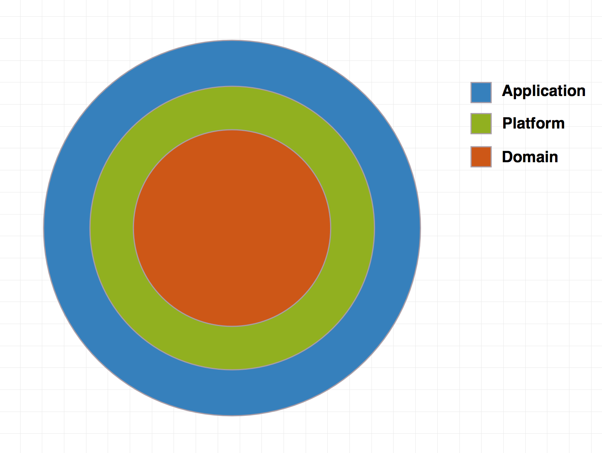
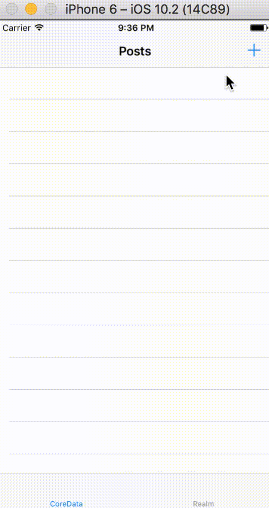
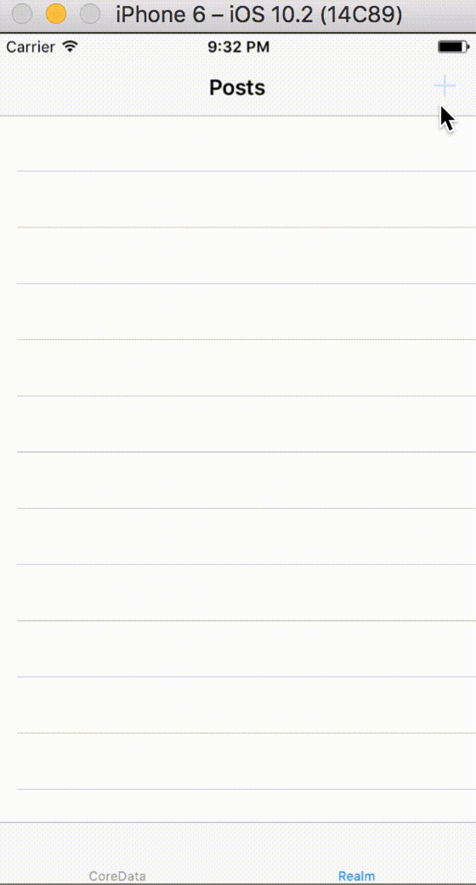

# Clean architecture with [RxSwift](https://github.com/ReactiveX/RxSwift)

## Contibutions are welcome and highly appreciated!!
You can do this by:

- opening an issue to discuss the current solution, ask a question, propose your solution etc. (also English is not my native language so if you think that something can be corrected please open a PR 😊)
- opening a PR if you want to fix bugs or improve something

##High level overview


#### Domain 


The `Domain` is basically what is your App about and what it can do (Entities, UseCase etc.) **It does not depend on UIKit or any persistence framework**, and it doesn't have implementations apart from entities

#### Platform

The `Platform` is a concrete implementation of the `Domain` in a specific platform like iOS. It does hide all implementation details. For example Database implementation whether it is CoreData, Realm, SQLite etc.

#### Application
The `Application` is responsible for delivering information to the user and handling user input. It can be implemented with any delivery pattern e.g (MVVM, MVC, MVP). It is place where you have your `UIView`s and `UIViewController`s. As you will see from the example app `ViewControllers` are completely independant on the `Platform` the only responsobility of view controller is to "bind" UI and Domain to make things happened. In fact in the current example we are using the same view controller which binds to the Platform with Realm or CoreData storage under the hood.

`Application` is responsible for delivering information to the user and handling user input. It can be implemented with any delivery pattern e.g (MVVM, MVC, MVP). This is the place for your `UIView`s and `UIViewController`s. As you will see from the example app, `ViewControllers` are completely independent of the `Platform`.  The only responsobility of a view controller is to "bind" the UI to the Domain to make things happen. In fact, in the current example we are using the same view controller for Realm and CoreData.


##Detail overview

 
To enforce modularity, `Domain`, `Platform` and `Application` are separate targets in the App, which allows us to take advantage of the `internal` access layer in Swift to prevent exposing of types that we don't want to expose.

#### Domain

Entities are implemented as Swift value types

```swift
public struct Post {
    public let uid: String
    public let createDate: Date
    public let updateDate: Date
    public let title: String
    public let content: String
}
```

UseCases are protocols which do one specific thing:

```swift

public protocol AllPostsUseCase {
    func posts() -> Observable<[Post]>
}

public protocol SavePostUseCase {
    func save(post: Post) -> Observable<Void>
}

```

`UseCaseProvider` is a [service locator](https://en.wikipedia.org/wiki/Service_locator_pattern).  In the current example, it helps to hide the concrete implementation of use cases.

#### Platform

In some cases, we can't use Swift structs for our domain objects because of DB framework requirements (e.g. CoreData, Realm). 

```swift
final class CDPost: NSManagedObject {
    @NSManaged public var uid: String?
    @NSManaged public var title: String?
    @NSManaged public var content: String?
    @NSManaged public var createDate: NSDate?
    @NSManaged public var updateDate: NSDate?
}

final class RMPost: Object {
    dynamic var uid: String = ""
    dynamic var createDate: NSDate = NSDate()
    dynamic var updateDate: NSDate = NSDate()
    dynamic var title: String = ""
    dynamic var content: String = ""
}

```


The `Platform` also contains concrete implementations of your use cases, repositories or any services that are defined in the `Domain`.

```swift
final class SavePostUseCase: Domain.SavePostUseCase {
    private let repository: AbstractRepository<Post>

    init(repository: AbstractRepository<Post>) {
        self.repository = repository
    }

    func save(post: Post) -> Observable<Void> {
        return repository.save(entity: post)
    }
}

final class Repository<T: CoreDataRepresentable>: AbstractRepository<T> where T == T.CoreDataType.DomainType {
    private let context: NSManagedObjectContext
    private let scheduler: ContextScheduler

    init(context: NSManagedObjectContext) {
        self.context = context
        self.scheduler = ContextScheduler(context: context)
    }

    override func query(with predicate: NSPredicate? = nil,
                        sortDescriptors: [NSSortDescriptor]? = nil) -> Observable<[T]> {
        let request = T.CoreDataType.fetchRequest()
        request.predicate = predicate
        request.sortDescriptors = sortDescriptors
        return context.rx.entities(fetchRequest: request)
            .mapToDomain()
            .subscribeOn(scheduler)
    }

    override func save(entity: T) -> Observable<Void> {
        return entity.sync(in: context)
            .mapToVoid()
            .concat(context.rx.save())
            .skip(1) // We don't want to receive event for sync
            .subscribeOn(scheduler)
    }
}

```

As you can see, concrete implementations are internal, because we don't want to expose our dependecies. The only thing that is exposed in the current example from the `Platform` is `ServiceLocator`.

```swift
public final class ServiceLocator: Domain.ServiceLocator {
    public static let shared = ServiceLocator()

    private let coreDataStack = CoreDataStack()
    private let postRepository: Repository<Post>

    private init() {
        postRepository = Repository<Post>(context: coreDataStack.context)
    }

    public func getAllPostsUseCase() -> Domain.AllPostsUseCase {
        return CDAllPostsUseCase(repository: postRepository)
    }

    public func getCreatePostUseCase() -> Domain.SavePostUseCase {
        return CDSavePostUseCase(repository: postRepository)
    }
}
```

#### Application

In the current example, `Application` is implemented with the [MVVM](https://en.wikipedia.org/wiki/Model–view–viewmodel) pattern and heavy use of [RxSwift](https://github.com/ReactiveX/RxSwift), which makes binding very easy.


Where the `ViewModel` performs pure transformation of a user `Input` to the `Output`

```swift

protocol ViewModelType {
    associatedtype Input
    associatedtype Output
    
    func transform(input: Input) -> Output
}
```


```swift
final class PostsViewModel: ViewModelType {
    struct Input {
        let trigger: Driver<Void>
        let createPostTrigger: Driver<Void>
        let selection: Driver<IndexPath>
    }
    struct Output {
        let fetching: Driver<Bool>
        let posts: Driver<[Post]>
        let createPost: Driver<Void>
        let selectedPost: Driver<Post>
        let error: Driver<Error>
    }
    
    private let useCase: AllPostsUseCase
    private let navigator: PostsNavigator
    
    init(useCase: AllPostsUseCase, navigator: PostsNavigator) {
        self.useCase = useCase
        self.navigator = navigator
    }
    
    func transform(input: Input) -> Output {
       ......
    }
```

A `ViewModel` can be injected into a `ViewController` via property injection or initializer. In the current example, this is done by `Navigator`.

```swift

protocol PostsNavigator {
    func toCreatePost()
    func toPost(_ post: Post)
    func toPosts()
}

class DefaultPostsNavigator: PostsNavigator {
    private let storyBoard: UIStoryboard
    private let navigationController: UINavigationController
    private let services: ServiceLocator
    
    init(services: ServiceLocator,
         navigationController: UINavigationController,
         storyBoard: UIStoryboard) {
        self.services = services
        self.navigationController = navigationController
        self.storyBoard = storyBoard
    }
    
    func toPosts() {
        let vc = storyBoard.instantiateViewController(ofType: PostsViewController.self)
        vc.viewModel = PostsViewModel(useCase: services.getAllPostsUseCase(),
                                      navigator: self)
        navigationController.pushViewController(vc, animated: true)
    }
    ....
}

class PostsViewController: UIViewController {
    private let disposeBag = DisposeBag()
    
    var viewModel: PostsViewModel!
    
    ...
}
```

### Example

The example app is Post/TODOs app which uses `Realm` and `CoreData` at the same time as a proof of concept that the `Application` level is not dependant on the Platform level implementation details.

| CoreData | Realm |
| -------- | ----- |
| |  |


### TODO:

* add tests 
* add [MVP](https://en.wikipedia.org/wiki/Model–view–presenter) example
* [Redux](http://redux.js.org) example??

### Links
* [RxSwift](https://github.com/ReactiveX/RxSwift)
* [Robert C Martin - Clean Architecture and Design](https://www.youtube.com/watch?v=Nsjsiz2A9mg)
* [Cycle.js](https://cycle.js.org)
* [ViewModel](https://medium.com/@SergDort/viewmodel-in-rxswift-world-13d39faa2cf5#.qse37r6jw) in Rx world

### Any questions?

* ping me on [Twitter](https://twitter.com/SergDort)
