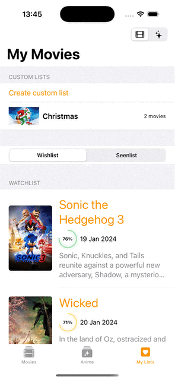
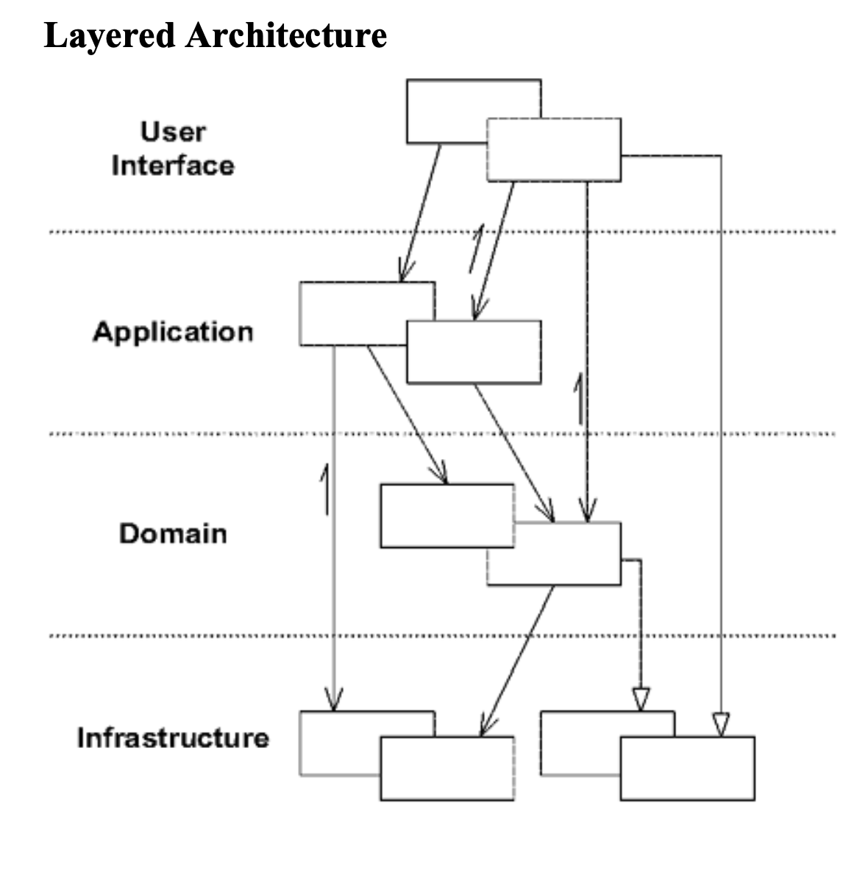
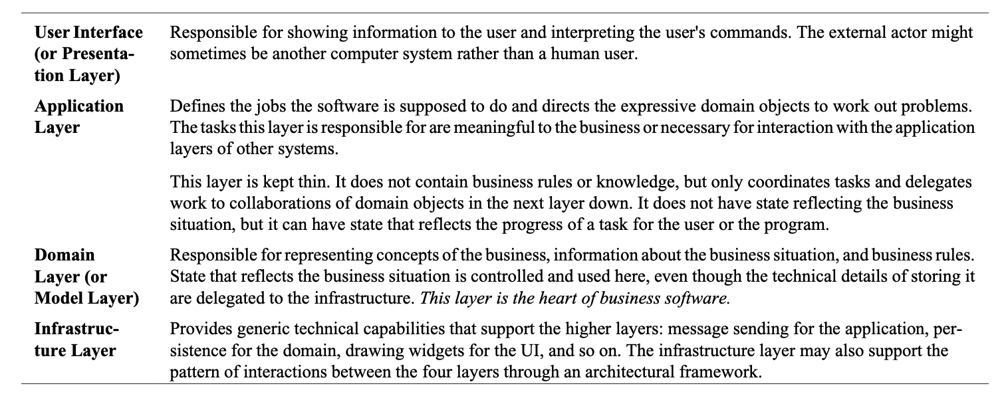
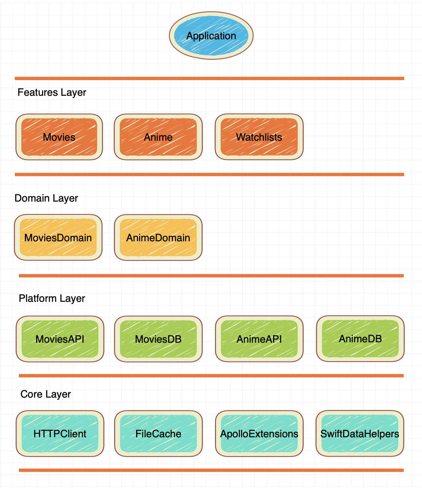
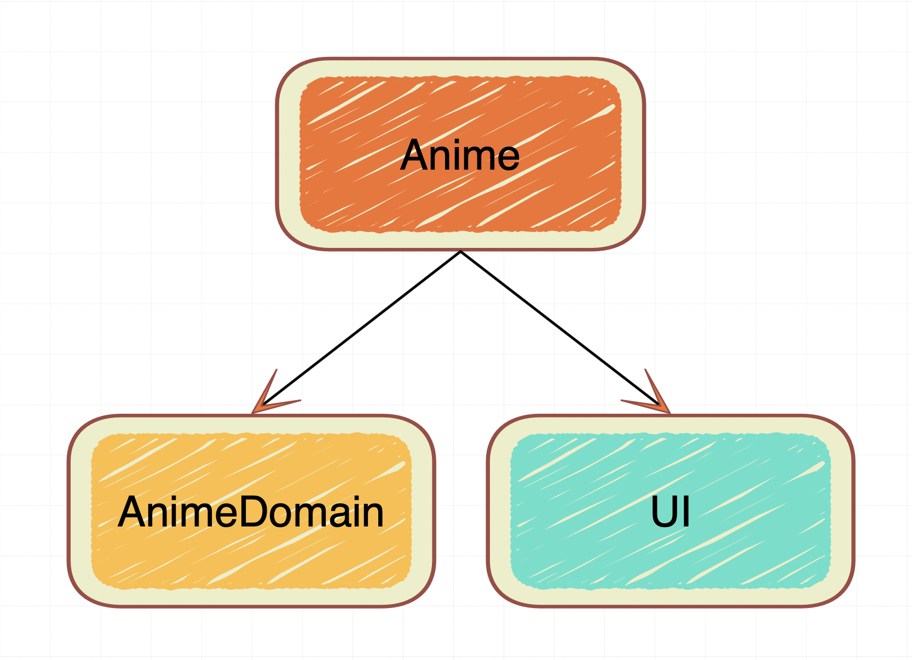
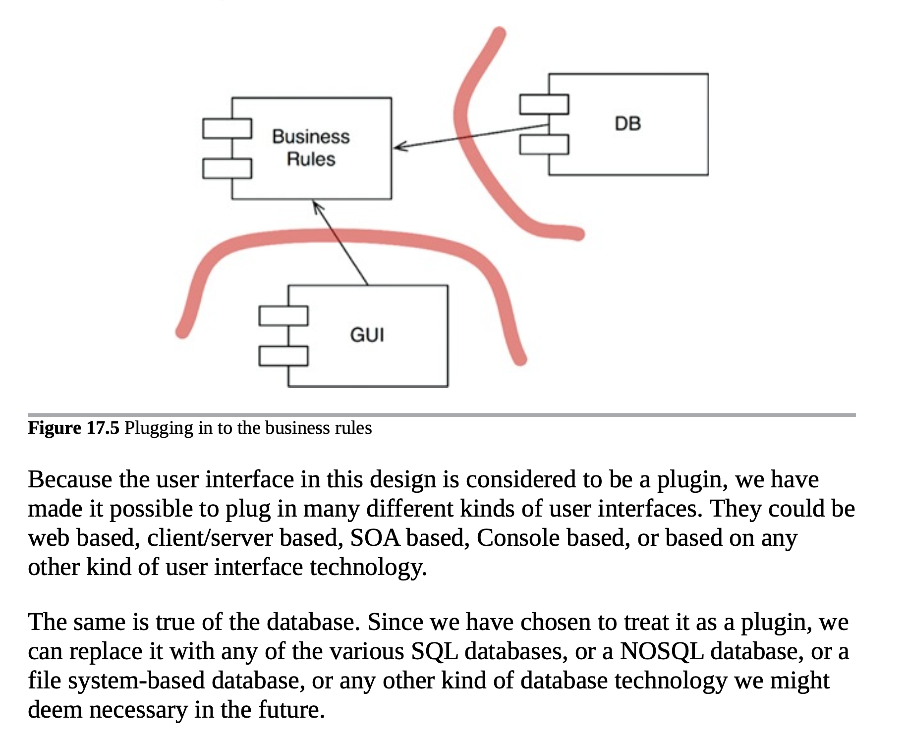
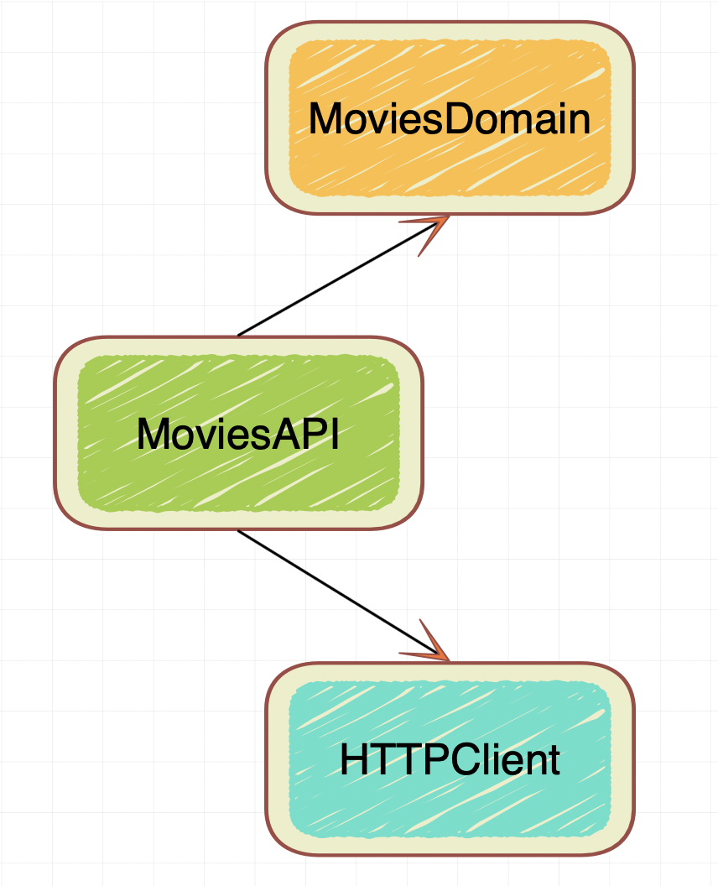

# Modern Clean Architecture

## Motivation

The purpose of this repository is to serve as a comprehensive resource for iOS developers seeking to understand 
and apply the principles of Domain-Driven Design (DDD) and Clean Architecture in their software projects. The modularization technics are heavily inspired by these two books [Domain-Driven Design: Tackling Complexity in the Heart of Software](https://amzn.eu/d/etWIrog), [Clean Architecture](https://amzn.eu/d/477lqj8)

## Example

As an example we going to build an app that lets us explore [Movies](https://developer.themoviedb.org/reference) and [Anime](https://anilist.co) API. 

| Movies | Movie Detail | Anime | Anime Detail | My Lists |
| --- | --- | --- | --- | --- |
|  |  |  |  |  |

## How to run the example

You will need to install the Tuist first. You can follow their official [documentation](https://docs.tuist.dev/en/guides/quick-start/install-tuist) on how do do that. Once you've got tuist installed. You need to run two commands in the root of the project folder

```
tuist install
tuist generate
```

## Layered Archtecture






> The application also makes no assumptions about the source of the transfer request. The program
presumably includes a UI with entry fields for account numbers and amounts and with buttons for
commands. But that user interface could be replaced by a wire request in XML without affecting the
application layer or any of the lower layers. **This decoupling is important not because projects frequently need to replace user interfaces with wire requests but because a clean separation of concerns keeps the design of each layer easy to understand and maintain.**
> 
> Domain-Driven Design: Tackling Complexity in the Heart of Software

**In the context of iOS development and our example application, the layers are structured as follows:**



## Responsibilities

### Domain

Domain Layer plays a central role by encapsulating the core business logic and rules of the application. Its purpose is to model the problem domain effectively and ensure that business requirements are met in a clear and maintainable way. It includes entities, value objects, and aggregates that represent concepts within the business domain. It contains UseCase definition and implementation. By isolating business logic within the Domain Layer, we ensure that application-specific concerns (e.g., UI, infrastructure) don’t pollute the domain model.

### Features

The Features layer is responsible for implementing UI business requirements, building individual screens, and coordinating Domain UseCases by invoking their various methods. As an example I implemented `Movies` feature using MVVM design pattern which with introduction of SwiftUI feets nicely into iOS ecosystem.


Another example of a UI design pattern is my use of [TCA](https://github.com/pointfreeco/swift-composable-architecture) to implement the Anime feature. TCA, being an excellent implementation of a [Finite State Machine](https://en.wikipedia.org/wiki/Finite-state_machine#:~:text=It%20is%20an%20abstract%20machine,another%20is%20called%20a%20transition.), integrates seamlessly into the SwiftUI ecosystem.
The purpose of these two examples is to demonstrate that with proper modularization and decoupling, the choice of UI architecture pattern becomes less critical, as each has its own advantages and trade-offs.

For navigation abstraction, I used the Coordinator pattern, which, at its core, is essentially just the Delegate pattern. From the perspective of a ViewModel or Reducer, navigation is simply delegated as a side effect to another object. With the addition of APIs like [NavigationStack](https://developer.apple.com/documentation/swiftui/navigationstack), SwiftUI’s navigation abstraction has become more complete, making navigation implementation [much simpler](https://github.com/sergdort/ModernCleanArchitecture/blob/master/Projects/Example/Sources/Navigation/Movies/MoviesNavigationView.swift).

```swift
@MainActor
public protocol MoviesCoordinator {
    func showDetail(for movie: Movie)
    func showDetail(for person: Person)
    func showAddMovieToCustomList(for movie: Movie)
}

public final class MoviesViewModel {
    @ObservationIgnored
    private let coordinator: MoviesCoordinator
    
    func didSelect(movie: Movie) {
        coordinator.showDetail(for: movie)
    }
}
```

In terms of dependencies, feature modules rely solely on the Domain layer and the UI. The concrete implementations of UseCases are injected at runtime by the Application layer.



### Application

The Application layer is responsible for creating the main user interface, setting up and instantiating concrete implementations of UseCases, and injecting them using the [@Dependecy](https://github.com/pointfreeco/swift-dependencies) library. Another key responsibility of the Application layer is managing navigation and injecting dependencies into the Features layer.
You might wonder why the Application layer should handle navigation instead of the features themselves. The answer lies in the Application layer's responsibility: it is tasked with creating the main user interface, which inherently provides it with a complete understanding of the navigation hierarchy and the context necessary to manage navigation effectively.

### Platform and "Plugin architecture"
> From the Robert C. Martin "Clean Architecture"
> 


The purpose of the Platform layer is to utilize the Core layer's implementation and the Domain business rules (e.g., Entities and UseCases) to provide concrete implementations. For example, the MoviesAPI leverages the MovieDomain and the HTTPClient module to implement MoviesGateway, enabling interaction with the MoviesDBAPI. Similarly, the MoviesDB module uses FileCache or SwiftData to persist previously downloaded data.

This approach supports a plugin design, allowing for flexibility to swap or modify the underlying implementations of the database or API as needed. For instance, the AnimeAPI uses GraphQL to fetch data, and this design ensures that implementation details remain hidden from the Features layer. This approach is improrant not because we will be changing our DB or API every other day, but because it allows us to decouble our business rules from the concrete implementaion making it easier to maintain.



### Core

The Core layer is responsible for implementing the foundational infrastructure of the application, such as the HTTP library, SwiftData extensions, Apollo extensions, FileCache, and other essential utilities.

## Developer Productivity

One of the most critical aspects of good architecture is to enable the team to be productive. Let’s explore how effective modularization techniques and the Dependency Inversion Principle can significantly reduce Feature modules build times. As shown earlier, Feature module depends only on the UI and Domain modules, day-to-day development tasks can take advantage of Xcode Previews or feature-specific example apps, eliminating the need to build most of the application.


